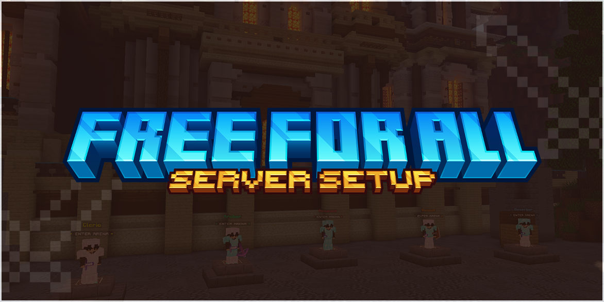

# 🔵 Free for All Setup

These docs will cover how to set up the **Free for All** Server Setup created by thomaskeig.


You are assumed to have already purchased the resource and have a license. If not, the resource can be purchased using one of the supported websites below.


BuiltByBit: [https://builtbybit.com/r/25174/](https://builtbybit.com/r/25174/)\
Polymart: [https://polymart.org/r/2864](https://polymart.org/r/2864)

Make sure to read my [Terms of Service](../../miscellaneous/terms-of-service.md) before purchasing!

<figure><figcaption></figcaption></figure>
